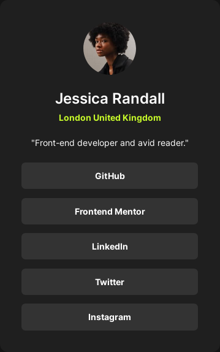

# Frontend Mentor - Social links profile solution

This is a solution to the [Social links profile challenge on Frontend Mentor](https://www.frontendmentor.io/challenges/social-links-profile-UG32l9m6dQ). Frontend Mentor challenges help you improve your coding skills by building realistic projects.

## Table of contents

- [Overview](#overview)
  - [The challenge](#the-challenge)
  - [Screenshot](#screenshot)
  - [Links](#links)
- [Built with](#built-with)
- [Author](#author)

## Overview

### The challenge

Users should be able to:

- See hover and focus states for all interactive elements on the page

### Screenshot

### Links

- Solution URL: [https://github.com/mickael-o3o/social-links-profile-solution.git](https://github.com/mickael-o3o/social-links-profile-solution.git)
- Live Site URL: [https://mickael-o3o.github.io/social-links-profile-solution](https://mickael-o3o.github.io/social-links-profile-solution)

## Built with

- [Vuejs](https://vuejs.org)
- [Sass](https://sass-lang.com)
- Mobile-first workflow

## Author

- Frontend Mentor - [@mickael-o3o](https://www.frontendmentor.io/profile/mickael-o3o)
